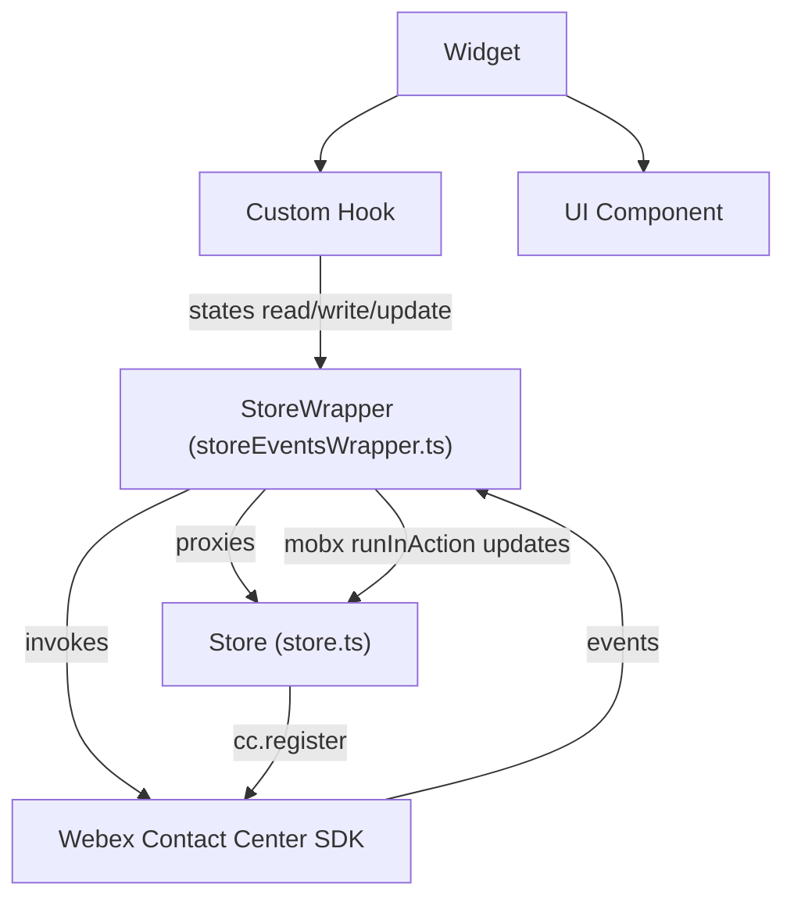
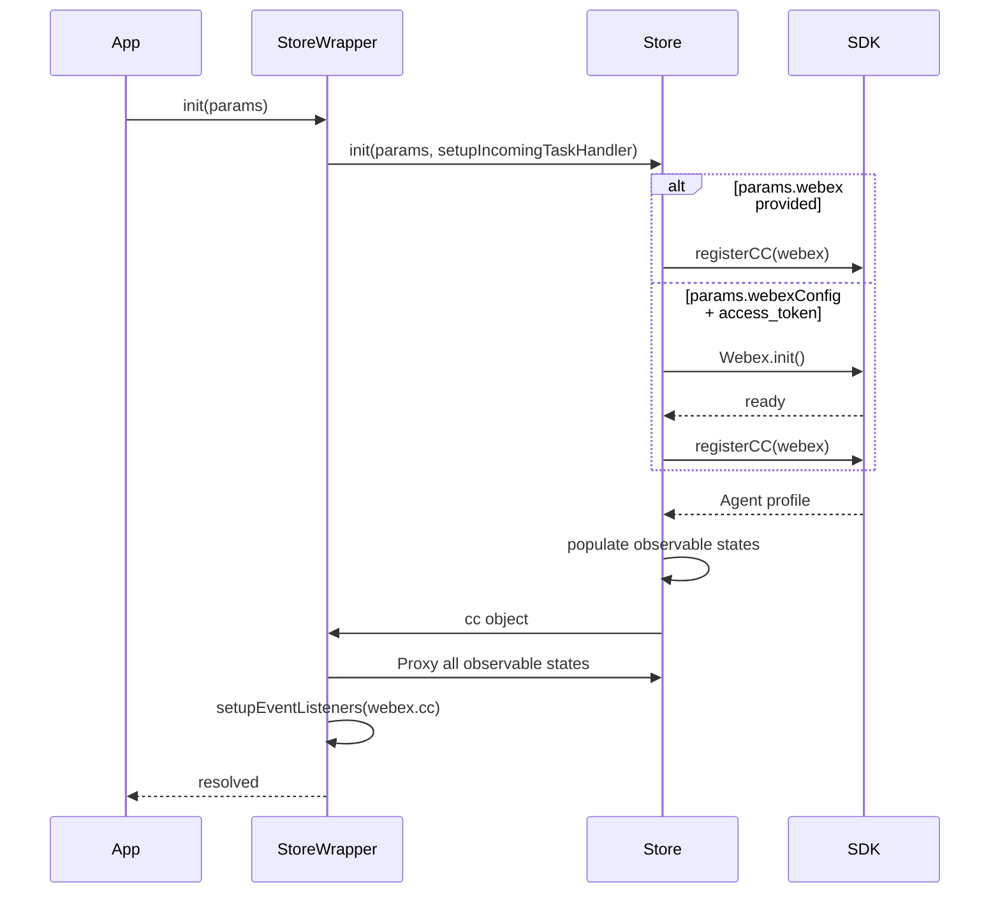
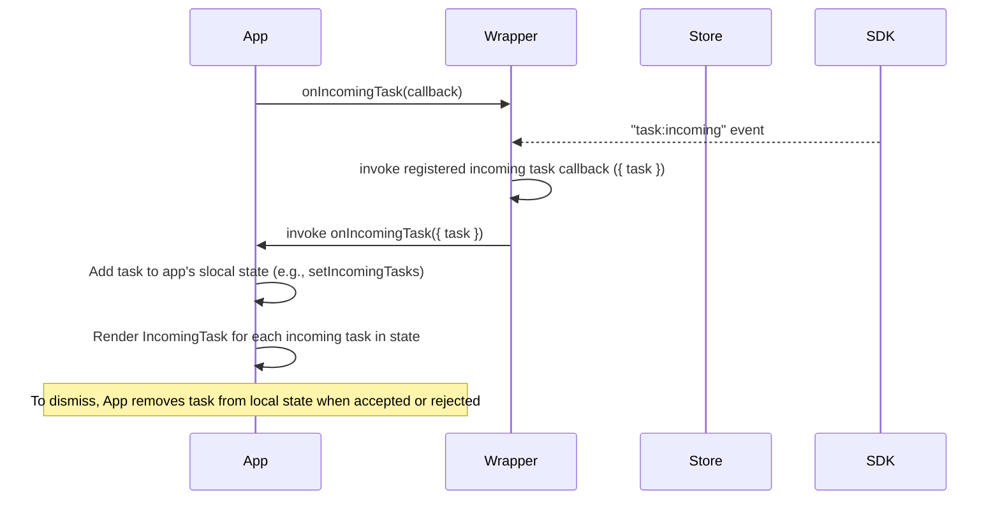
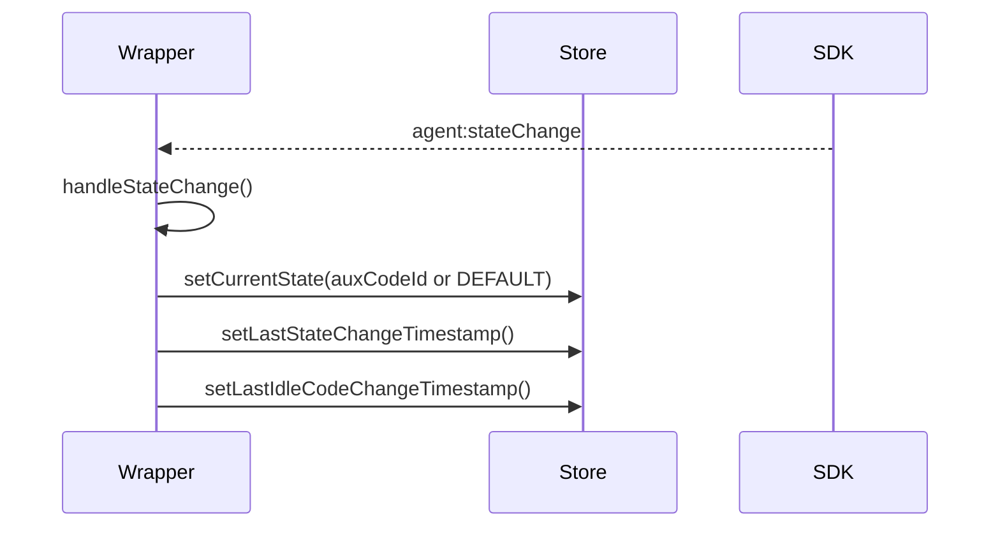
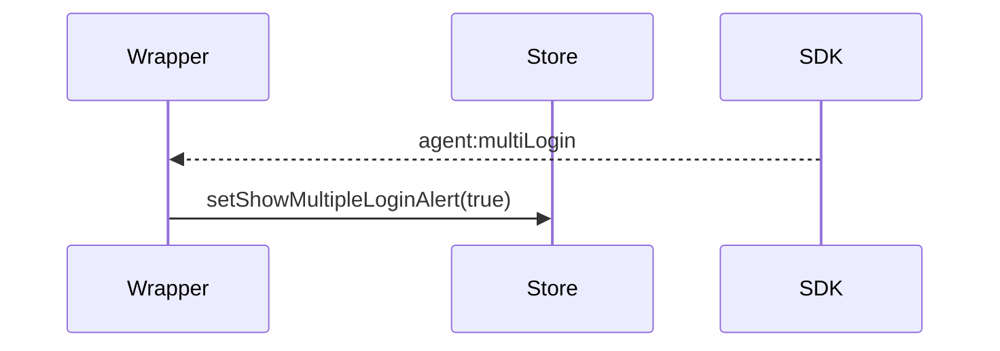
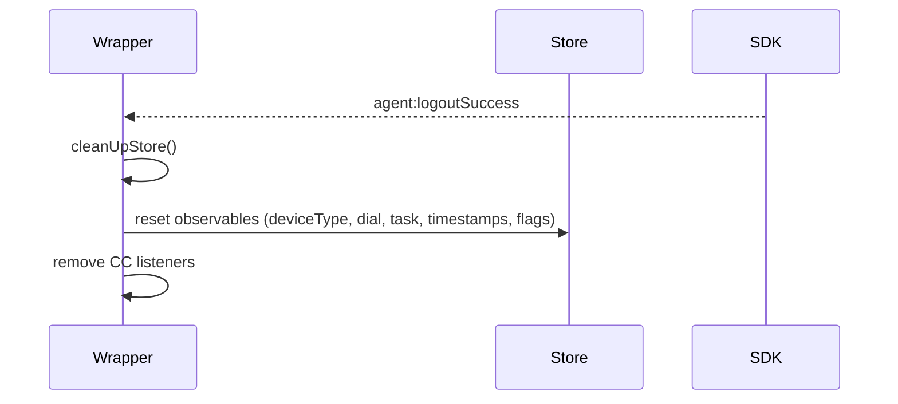

# Contact Center Store — Architecture

## Component Overview

The Store is a singleton state management object built with MobX, responsible for observing state changes and emitting updates to all Contact Center widgets. It must be initialized before any widgets can be used. This document explains the Store’s structure, initialization requirements, wrapper, integration with the SDK, core data flows, and typical usage scenarios.

### Components Table

| Layer | Component | File | State | Methods / Responsibilities | Events | Tests |
|-------|-----------|------|-------|----------------------------|--------|-------|
| **Store (core)** | `Store` | `src/store.ts` | Teams, loginOptions, idleCodes, wrapupCodes, agentProfile, isAgentLoggedIn, deviceType, dialNumber, teamId, taskList, currentTask, featureFlags, timestamps, flags | `init()`, `registerCC()`, populate observables from SDK profile, parse feature flags | N/A | `packages/contact-center/store/tests/*` |
| **Store (wrapper)** | `StoreWrapper` | `src/storeEventsWrapper.ts` | Proxies all observables | Event wiring, list fetchers, mutations, error callback, task lifecycle handling, media handling | Subscribes to `CC_EVENTS` and `TASK_EVENTS` | Same |
| **Index** | Re-exports | `src/index.ts` | N/A | Default export of `StoreWrapper`, exports types and enums | N/A | Same |
| **Consumers** | Widgets/Hooks | Various | Read-only (observer) | Use store methods and observables; set callbacks | Receive reactions via MobX | Various |
| **SDK** | Webex CC SDK | `@webex/contact-center` | N/A | Provides methods/events | Emits CC/TASK events | SDK tests |

---

## SDK Methods & Events Integration

| Area | SDK Methods Used | SDK Events Subscribed | Store/Wrapper Methods |
|------|-------------------|-----------------------|-----------------------|
| Initialization | `register()`, `LoggerProxy` | `agent:dnRegistered`, `agent:reloginSuccess`, `agent:stationLoginSuccess` | `init()`, `registerCC()`, `setupIncomingTaskHandler()` |
| Agent Session | `stationLogin()`, `stationLogout()`, `deregister()` | `agent:logoutSuccess`, `agent:multiLogin` | `cleanUpStore()`, `setShowMultipleLoginAlert()` |
| Agent State | `setAgentState()` | `agent:stateChange` | `handleStateChange()`, `setCurrentState()`, timestamp setters |
| Tasks | `taskManager.getAllTasks()` | `task:incoming`, `task:assigned`, `task:end`, `task:hydrate`, `task:merged`, consult/conference events, media events | `registerTaskEventListeners()`, `refreshTaskList()`, `setCurrentTask()`, consult handlers, media handling |
| Directory & Lists | `getBuddyAgents()`, `getQueues()`, `getEntryPoints()`, `addressBook.getEntries()` | (N/A) | `getBuddyAgents()`, `getQueues()`, `getEntryPoints()`, `getAddressBookEntries()` |

> Events enums exported via `TASK_EVENTS` and `CC_EVENTS` from `src/store.types.ts`.

---

## File Structure

```
store/
├── src/
│   ├── index.ts                 # Re-exports default store wrapper and types
│   ├── store.ts                 # Core Store (MobX observables, init/register)
│   ├── store.types.ts           # Types, enums, public API surface
│   ├── storeEventsWrapper.ts    # Wrapper: events wiring, helpers, mutations
│   ├── task-utils.ts            # Task helpers (e.g., isIncomingTask)
│   ├── util.ts                  # Feature flags parsing, utilities
│   └── constants.ts             # Shared constants (if any)
├── tests/                       # Store unit tests
├── ai-prompts/
│   ├── agent.md                 # Overview & usage
│   └── architecture.md          # This file
├── package.json
├── tsconfig.json
└── webpack.config.js
```

---

## Data Flows

### Layer Communication Flow



---

## Sequence Diagrams

### 1) Store Initialization



### 2) Incoming Task Handling



### 3) Agent State Change



### 4) Multi-login Alert



### 5) Logout and Cleanup



---

## Troubleshooting Guide

### Store Not Initializing
- Ensure Webex SDK is ready when passing `params.webex`
- If letting store init Webex, verify `webexConfig` and `access_token`
```typescript
await store.init({webexConfig, access_token});
console.log('CC instance:', store.cc); // should be defined
```

### No Events or State Updates
- Verify `setCCCallback` and `removeCCCallback` usage
- Confirm `init()` was awaited before rendering widgets
```typescript
store.setCCCallback(CC_EVENTS.AGENT_STATION_LOGIN_SUCCESS, (p) => console.log('login', p));
```

### Task List Stale
- Call `refreshTaskList()` after external task actions
```typescript
store.refreshTaskList();
```

### Address Book Empty
- Feature may be disabled; `isAddressBookEnabled` must be true
```typescript
if (!store.isAddressBookEnabled) {
  console.log('Address book disabled by org config');
}
```

### Error Boundary Triggered
- Set `setOnError` to surface details
```typescript
store.setOnError((name, err) => {
  console.error(`[${name}]`, err);
});
```

---

## Related Documentation

- Usage and examples: [agent.md](./agent.md)
- Store types and enums: `src/store.types.ts`
- MobX, React, and Testing patterns: `ai-docs/patterns/*`

---

_Last Updated: 2025-11-26_


